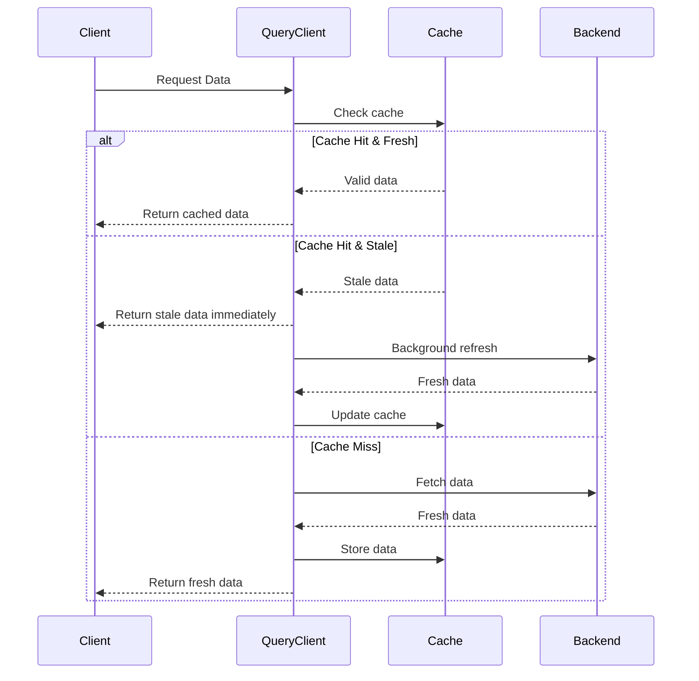
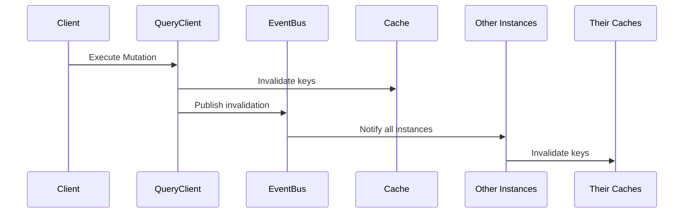
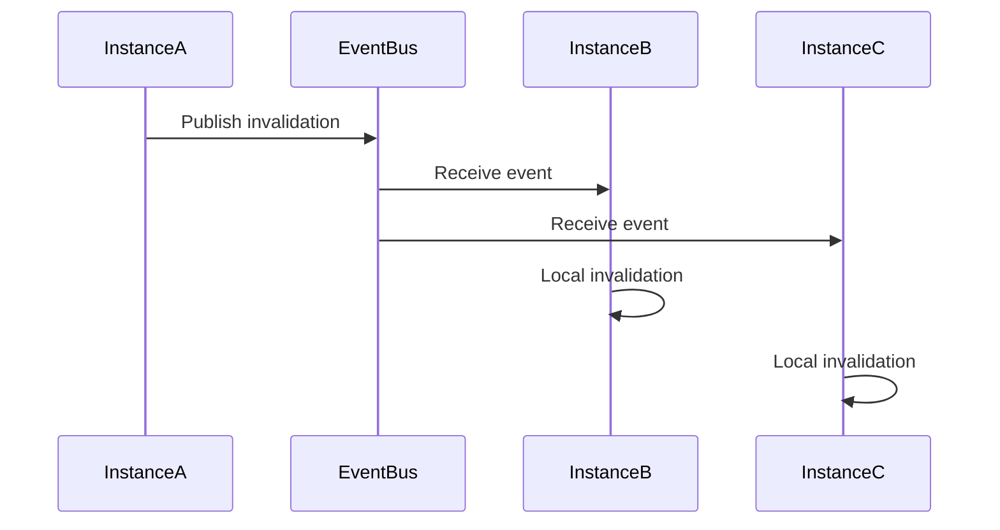

# Invalid8 Caching Library Documentation

## Overview

Invalid8 is a sophisticated, high-performance caching library for JavaScript/TypeScript applications, designed for modern distributed systems and CQRS architectures. It provides intelligent query caching with configurable stale/expiration times, automatic cache invalidation for mutations, distributed cache synchronization via event bus, and resilient retry mechanisms. Built with TypeScript, it offers type-safe caching solutions and avoids vendor lock-in by supporting pluggable cache adapters.

**Key Features:**
- 🚀 **React Query-like DX** for JavaScript with familiar patterns
- 🌐 **Distributed cache synchronization** across multiple instances
- ⚡ **High performance** with minimal overhead
- 🛡️ **Resilient design** with circuit breakers and retry policies
- 📊 **Comprehensive observability** with metrics and logging
- 🎯 **CQRS-optimized** for read/write separation
- 🛠️ **TypeScript-first** with full type safety
- 🔌 **Pluggable adapters** for cache and framework flexibility
- 🏗️ **Framework-agnostic** with deep NestJS integration and support for custom adapters (Express, Fastify, Next.js, React, Nuxt, Angular, etc.)

## Functional Requirements

- **Query Caching**: Cache query results with configurable stale and cache times.
- **Mutation Invalidation**: Automatically invalidate cache keys upon mutation operations.
- **Optimistic Updates**: Support optimistic updates with rollback capabilities for better UX.
- **Distributed Synchronization**: Synchronize cache invalidation across multiple instances using an event bus.
- **Background Refresh**: Serve stale data while refreshing in the background for improved performance.
- **Tag-Based Invalidation**: Invalidate cache entries by associated tags for flexible cache management.
- **Retry Mechanism**: Implement resilient retry logic for queries and mutations.
- **Metrics and Logging**: Provide observability through cache hit/miss metrics and operation latency tracking.
- **Custom Adapters**: Allow users to install and register cache adapters (e.g., Redis, In-Memory) and framework adapters (e.g., NestJS, Express, Fastify, Next.js).

## Technical Requirements

- **Language**: TypeScript/JavaScript (ES Modules, Node.js 16+ compatible).
- **Cache Backends**: In-memory (default), Redis (optional via `@invalid8/redis-adapter`), or custom cache providers.
- **Event Bus**: Support for event buses like Redis Pub/Sub or custom implementations.
- **Dependencies**: Minimal core dependencies; optional adapters installed separately to avoid vendor lock-in.
- **Browser Support**: Compatible with modern browsers (Chrome, Firefox, Safari, Edge).
- **Type Safety**: Full TypeScript support with strict type checking.
- **Performance**: Cache hit latency <5ms, minimal overhead for cache misses.
- **Scalability**: Designed for distributed systems with horizontal scaling.
- **Observability**: Integration with popular logging frameworks (e.g., `winston`) and metrics (e.g., Prometheus).
- **Framework Support**: Deep integration with NestJS; extensible for Express, Fastify, Next.js, React, Nuxt, Angular via custom adapters.

## Core Concepts

### 1. Cache Lifecycle



### 2. Cache Invalidation



## API Reference

### Core Methods

#### `queryAsync<T>(key: string[], queryFunc: () => Promise<T>, options?: QueryOptions): Promise<T>`
**Purpose**: Execute a query with caching support.

**Parameters**:
- `key`: Array representing the cache key (e.g., `["users", "id123"]`).
- `queryFunc`: Async function to fetch data if not in cache.
- `options`: Cache configuration (stale time, cache time, etc.).

**Flow**:
1. Checks cache first.
2. Returns cached data if valid.
3. Fetches fresh data if cache miss/stale.
4. Updates cache in background if stale.

#### `mutateAsync<T>(mutationFunc: () => Promise<T>, options?: MutationOptions): Promise<T>`
**Purpose**: Execute a mutation with automatic cache invalidation.

**Parameters**:
- `mutationFunc`: Async mutation operation.
- `options`: Invalidation configuration.

**Flow**:
1. Executes mutation.
2. Invalidates specified cache keys.
3. Publishes invalidation events to distributed cache.

#### `setQueryDataAsync<T>(key: string[], data: T, options?: CacheEntryOptions): Promise<void>`
**Purpose**: Manually update cache data (optimistic updates).

#### `updateQueryDataAsync<T>(key: string[], updateFunction: (current: T | null) => T, options?: CacheEntryOptions): Promise<void>`
**Purpose**: Transform existing cache data.

### Configuration Options

#### `QueryOptions`
| Property | Type | Default | Description |
|----------|------|---------|-------------|
| staleTime | number | 300000 | Time (ms) before data is considered stale |
| cacheTime | number | 1800000 | Time (ms) before data expires |
| retryCount | number | 3 | Number of retry attempts |
| retryDelay | number | 1000 | Delay (ms) between retries |
| enableBackgroundRefetch | boolean | true | Whether to refresh stale data in background |
| tags | string[] | [] | Tags for categorical invalidation |

#### `MutationOptions`
| Property | Type | Default | Description |
|----------|------|---------|-------------|
| invalidateQueries | string[][] | [] | Array of keys to invalidate |
| publishEvent | boolean | true | Whether to publish invalidation events |
| retryCount | number | 3 | Number of retry attempts |
| timeout | number | null | Operation timeout (ms) |

#### `OptimisticMutationOptions<T>`
| Property | Type | Default | Description |
|----------|------|---------|-------------|
| queryKeys | string[][] | Required | Keys to update optimistically |
| optimisticData | () => T | Required | Function to compute optimistic data |
| onSuccess | (result: T) => T | null | Transform result after success |
| rollbackOnError | boolean | true | Whether to rollback on error |
| onError | (error: Error) => void | null | Custom error handler |

## CQRS Implementation Guide

### Query Side Optimization (NestJS)

```typescript
import { Injectable } from '@nestjs/common';
import { QueryClient } from '@invalid8/core';

interface UserDto {
  id: string;
  name: string;
}

@Injectable()
class GetUserQueryHandler {
  constructor(
    private readonly queryClient: QueryClient,
    private readonly userRepository: UserRepository,
  ) {}

  async handle(userId: string): Promise<UserDto> {
    return await this.queryClient.queryAsync(
      ['users', userId],
      () => this.userRepository.getUserAsync(userId),
      {
        staleTime: 5 * 60 * 1000, // 5 minutes
        cacheTime: 60 * 60 * 1000, // 1 hour
        tags: ['users', `user:${userId}`],
      },
    );
  }
}
```

### Command Side with Automatic Invalidation (NestJS)

```typescript
import { Injectable } from '@nestjs/common';
import { QueryClient } from '@invalid8/core';

interface UpdateUserCommand {
  id: string;
  name: string;
}

@Injectable()
class UpdateUserCommandHandler {
  constructor(
    private readonly queryClient: QueryClient,
    private readonly userRepository: UserRepository,
  ) {}

  async handle(command: UpdateUserCommand): Promise<void> {
    await this.queryClient.mutateAsync(
      () => this.userRepository.updateUserAsync(command),
      {
        invalidateQueries: [
          ['users', command.id],
          ['users', 'list'],
          ['dashboard', 'stats'],
        ],
      },
    );
  }
}
```

### Optimistic Updates for Better UX (NestJS)

```typescript
import { Injectable } from '@nestjs/common';
import { QueryClient } from '@invalid8/core';

interface Todo {
  id: number;
  title: string;
  completed: boolean;
  updatedAt?: Date;
}

@Injectable()
class TodoService {
  constructor(
    private readonly queryClient: QueryClient,
    private readonly api: TodoApi,
  ) {}

  async completeTodoAsync(todoId: number): Promise<Todo> {
    return await this.queryClient.mutateAsync(
      () => this.api.completeTodoAsync(todoId),
      {
        queryKeys: [['todos', todoId.toString()]],
        optimisticData: () => ({ id: todoId, completed: true, title: 'Loading...' }),
        onSuccess: (result) => ({ ...result, updatedAt: new Date() }),
        rollbackOnError: true,
      },
    );
  }
}
```

### Distributed Cache Synchronization

```typescript
import { QueryClient, EventProvider } from '@invalid8/core';

// Service A (updates data)
await queryClient.mutateAsync(
  () => serviceA.updateOrderAsync(order),
  {
    invalidateQueries: [['orders', order.id]],
    publishEvent: true,
  },
);

// Service B (automatically receives invalidation)
await eventProvider.subscribeToInvalidations(async (invalidationEvent) => {
  for (const key of invalidationEvent.keys) {
    if (key[0] === 'orders') {
      await analyticsService.clearOrderCache(key[1]);
    }
  }
});
```

## Setup Guide

### 1. Installation

```bash
npm install @invalid8/core
# Optional: Install specific cache adapter
npm install @invalid8/redis-adapter
```

### 2. Basic In-Memory Setup (NestJS)

```typescript
import { Module } from '@nestjs/common';
import { Invalid8, InMemoryCache } from '@invalid8/core';

@Module({
  providers: [
    {
      provide: 'INVALID8',
      useFactory: () => {
        return new Invalid8({
          cacheProvider: new InMemoryCache(),
        });
      },
    },
    {
      provide: QueryClient,
      useFactory: (invalid8: Invalid8) => invalid8.createQueryClient(),
      inject: ['INVALID8'],
    },
  ],
  exports: [QueryClient],
})
export class CacheModule {}
```

### 3. Redis Production Setup (NestJS)

```typescript
import { Module } from '@nestjs/common';
import { Invalid8, RedisCache } from '@invalid8/core';
import { createClient } from 'redis';
import { RedisAdapter } from '@invalid8/redis-adapter';

@Module({
  providers: [
    {
      provide: 'INVALID8',
      useFactory: async () => {
        const redisClient = createClient({ url: 'redis://localhost:6379' });
        await redisClient.connect();
        return new Invalid8({
          cacheProvider: new RedisCache({ client: redisClient }),
        });
      },
    },
    {
      provide: QueryClient,
      useFactory: (invalid8: Invalid8) => invalid8.createQueryClient(),
      inject: ['INVALID8'],
    },
  ],
  exports: [QueryClient],
})
export class CacheModule {}
```

### 4. Custom Cache Adapter

```typescript
import { CacheProvider } from '@invalid8/core';

class CustomCache implements CacheProvider {
  async get<T>(key: string[]): Promise<T | null> {
    // Implement custom cache retrieval
  }

  async set<T>(key: string[], value: T, options?: CacheEntryOptions): Promise<void> {
    // Implement custom cache storage
  }

  async invalidate(key: string[]): Promise<void> {
    // Implement custom cache invalidation
  }
}

const invalid8 = new Invalid8({
  cacheProvider: new CustomCache(),
});
```

### 5. Framework Adapter (Express Example)

```typescript
import { Invalid8, QueryClient } from '@invalid8/core';
import express from 'express';

const app = express();
const invalid8 = new Invalid8({ cacheProvider: new InMemoryCache() });
const queryClient = invalid8.createQueryClient();

app.get('/users/:id', async (req, res) => {
  const user = await queryClient.queryAsync(
    ['users', req.params.id],
    () => userService.getUserAsync(req.params.id),
    { staleTime: 5 * 60 * 1000 },
  );
  res.json(user);
});
```

### 6. Framework Adapter (Custom Next.js Example)

```typescript
import { Invalid8, InMemoryCache } from '@invalid8/core';
import { NextApiRequest, NextApiResponse } from 'next';

const invalid8 = new Invalid8({ cacheProvider: new InMemoryCache() });
const queryClient = invalid8.createQueryClient();

export default async function handler(req: NextApiRequest, res: NextApiResponse) {
  const user = await queryClient.queryAsync(
    ['users', req.query.id as string],
    () => userService.getUserAsync(req.query.id as string),
    { staleTime: 5 * 60 * 1000 },
  );
  res.status(200).json(user);
}
```

### 7. Configuration Options

```typescript
import { Invalid8 } from '@invalid8/core';

const invalid8 = new Invalid8({
  defaultStaleTime: 5 * 60 * 1000, // 5 minutes
  defaultCacheTime: 30 * 60 * 1000, // 30 minutes
  enableBackgroundRefresh: true,
  maxRetryAttempts: 3,
  cacheProvider: new InMemoryCache(),
});
```

## Advanced Features

### 1. Background Refresh
When data becomes stale but isn't expired:
1. Returns stale data immediately.
2. Asynchronously refreshes data in the background.
3. Updates cache for subsequent requests.

### 2. Resilient Retries
Automatic retry mechanism for:
- Cache operations
- Query executions
- Event publishing
- Circuit breaker pattern integration

### 3. Distributed Invalidation



### 4. Tag-Based Invalidation

```typescript
import { QueryClient } from '@invalid8/core';

// Cache with tags
await queryClient.setQueryDataAsync(
  ['users', '123'],
  user,
  {
    tags: ['department:finance', 'region:us'],
  },
);

// Invalidate by tag
await queryClient.invalidateByTagAsync('department:finance');
```

## Best Practices

### 1. Key Design
- Use consistent key structures (e.g., `["entity-type", "id"]`).
- For lists, use prefix keys (e.g., `["users", "list"]`).
- Include domain context in keys (e.g., `["tenant:123", "users", "456"]`).

### 2. Timeout Configuration

```typescript
// Frequently changing data
{
  staleTime: 30 * 1000, // 30 seconds
  cacheTime: 5 * 60 * 1000, // 5 minutes
}

// Stable reference data
{
  staleTime: 60 * 60 * 1000, // 1 hour
  cacheTime: 24 * 60 * 60 * 1000, // 24 hours
}
```

### 3. Monitoring and Metrics

```typescript
import { QueryClient } from '@invalid8/core';

class CacheMetrics {
  constructor(private metrics: MetricsProvider) {}

  recordCacheHit(key: string[]) {
    this.metrics.increment('cache.hits');
  }

  recordCacheMiss(key: string[]) {
    this.metrics.increment('cache.misses');
  }

  recordLatency(key: string[], latency: number) {
    this.metrics.timing('cache.latency', latency);
  }
}
```

## Performance Characteristics

| Operation | Average Latency | Notes |
|-----------|-----------------|-------|
| Cache Hit | 1-5ms | Depends on cache provider |
| Cache Miss | Query latency + 5-10ms | Includes cache population |
| Mutation | Query latency + 10-20ms | Includes invalidation overhead |
| Distributed Invalidation | 50-100ms | Network latency dependent |

## Troubleshooting

| Symptom | Possible Cause | Solution |
|---------|---------------|----------|
| Stale data returned | Background refresh failed | Check logs for refresh errors |
| Cache not invalidating | Event bus issues | Verify event provider connectivity |
| High memory usage | Cache size too large | Implement eviction policies |
| Distributed cache out of sync | Network partitions | Check event bus connectivity |

## Migration Guide

### From Manual Caching

```typescript
// BEFORE: Manual cache management
async function getUserAsync(id: number): Promise<User> {
  const cacheKey = `user:${id}`;
  const cached = await cache.get<User>(cacheKey);
  if (cached) return cached;

  const user = await db.users.find(id);
  await cache.set(cacheKey, user, 30 * 60 * 1000);
  return user;
}

// AFTER: Invalid8 automated caching
async function getUserAsync(id: number): Promise<User> {
  return await queryClient.queryAsync(
    ['users', id.toString()],
    () => db.users.find(id),
  );
}
```

## Examples

### Basic Usage (NestJS)

```typescript
import { Controller, Get, Param } from '@nestjs/common';
import { QueryClient } from '@invalid8/core';

@Controller('users')
export class UserController {
  constructor(private readonly queryClient: QueryClient) {}

  @Get(':id')
  async getUser(@Param('id') userId: string) {
    return await this.queryClient.queryAsync(
      ['users', userId],
      () => userService.getUserAsync(userId),
    );
  }
}
```

### Advanced Scenario (NestJS)

```typescript
import { Injectable } from '@nestjs/common';
import { QueryClient } from '@invalid8/core';

interface Todo {
  id: number;
  title: string;
  completed: boolean;
  updatedAt?: Date;
}

@Injectable()
class TodoService {
  constructor(
    private readonly queryClient: QueryClient,
    private readonly api: TodoApi,
  ) {}

  async completeTodoAsync(todoId: number): Promise<Todo> {
    return await this.queryClient.mutateAsync(
      () => this.api.completeTodoAsync(todoId),
      {
        queryKeys: [['todos', todoId.toString()]],
        optimisticData: () => ({ id: todoId, completed: true, title: 'Loading...' }),
        onSuccess: (updatedTodo) => ({ ...updatedTodo, updatedAt: new Date() }),
        rollbackOnError: true,
      },
    );
  }
}
```

## Support

- **Documentation**: [GitHub Wiki](https://github.com/jeremiah-olisa/Invalid8/wiki)
- **Issues**: [GitHub Issues](https://github.com/jeremiah-olisa/Invalid8/issues)
- **Discussions**: [GitHub Discussions](https://github.com/jeremiah-olisa/Invalid8/discussions)

## License

MIT License - feel free to use in commercial projects.

---

*Invalid8 - Intelligent Caching for Modern JavaScript/TypeScript Applications*